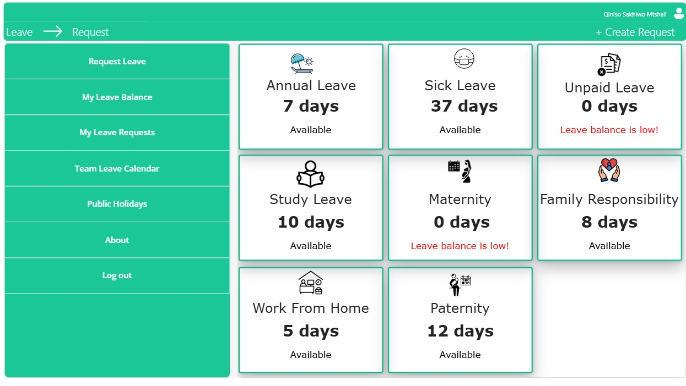
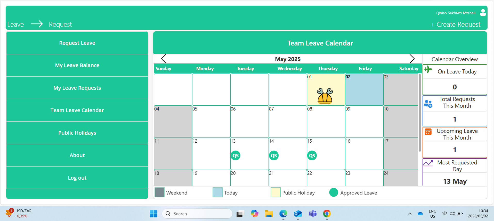

# 🏥 HearConnect Leave Request App

A Microsoft Power Platform solution for streamlined digital leave management at HearConnect. This app replaces manual processes with automated workflows that enhance transparency, improve efficiency, and support real-time decision-making across departments.

---

## 🚀 Overview

The Leave Request App is designed for modern organizations looking to digitize and optimize their leave request and approval processes. Built using **Power Apps**, **Power Automate**, and **SharePoint Online**, it integrates smoothly with **Microsoft Teams** and **Outlook** as part of the Microsoft 365 ecosystem.

---

## 🔑 Key Features

### 👤 Employees
- ✅ Smart leave request submission with prefilled user data
- 🔍 Real-time status tracking
- 📊 Leave balance monitoring (Annual, Sick, Study, etc.)
- 📅 Team calendar integration for better planning

### 👨‍💼 Managers
- 📥 Approve/reject via Teams or email
- 👀 Full team leave visibility
- 🔄 Auto-updated balances post-approval

### 🧑‍💼 HR/Admin
- 📈 Centralized reporting
- 🔒 Role-based permissions and audit trail
- 📏 Built-in policy enforcement with automated rules

---

## 🛠️ Technology Stack

| Platform         | Purpose                         |
|------------------|----------------------------------|
| Power Apps       | Front-end (Canvas App)           |
| Power Automate   | Workflow automation              |
| SharePoint Online| Backend data storage             |
| Teams & Outlook  | Notifications and approvals      |
| Microsoft 365    | Security & user authentication   |

---

## 📱 Interface Preview

> 📸 *Note: All screenshots use mock/demo data to protect internal information.*

<i>Main dashboard showing leave requests and team calendar</i>

<i>Leave request form with document upload</i>

<i>Team calendar view for scheduling awareness</i>

---

## 📂 Documentation

Explore the full project documentation in the [`docs/`](docs) folder:

- 📄 [Data Model](docs/data-model.md)  
  *Structure and purpose of all SharePoint lists*
  
- 📄 [Roles & Permissions](docs/roles-and-permissions.md)  
  *Who can do what in the system*

- 📄 [Feature Summary](docs/feature-summary.md)  
  *Overview of app functionality by role*

---

## 🏗️ Architecture Overview

Follows a clean 3-tier architecture pattern:
- **UI Layer**: Power Apps
- **Logic Layer**: Power Automate
- **Data Layer**: SharePoint Online

---

## 🔒 Security & Compliance

- 🔐 Role-Based Access Control (RBAC)
- 🧾 Audit logging
- 📁 Data retention policies
- 🇪🇺 GDPR-aligned design
- 🔐 Azure Active Directory integration

---

## 📊 Business Benefits

| Benefit                  | Impact                                   |
|--------------------------|-------------------------------------------|
| ⏱️ 95% reduction in paperwork | Fast, automated requests & decisions     |
| 🔍 Real-time visibility   | Clear request tracking & history         |
| 📏 Policy compliance      | Built-in validation logic                |
| 📆 Calendar transparency  | Improved leave planning for managers     |

---

## 🔒 Data & IP Disclaimer

This repository **does not contain any production data or environment exports**. Screenshots, fields, and documentation are anonymized and mock-based. The source system remains confidential and is property of HearConnect.

---

## ✍️ Author

**Qiniso Sakhiwo Mtshali**  
Power Platform Developer  
🔗 [LinkedIn](https://www.linkedin.com/in/qiniso-mtshali)  
🛠️ *Project built during internship at HearConnect*

---

## 📌 Project Status

- ✅ **Live in Production**  
- 🔐 **Internal Use Only**  
- 💼 **Showcase Portfolio** – For reference and demo purposes

---

## 📜 License

This is proprietary software developed exclusively for HearConnect.  
All rights reserved. Redistribution or reuse is not permitted without written consent.

